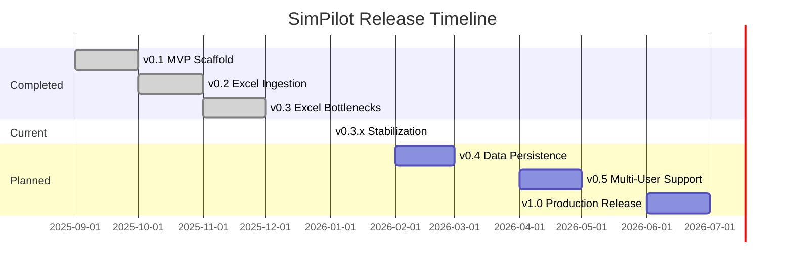

# SimPilot Product Roadmap

> **Last Updated:** January 2026  
> **Current Version:** v0.3 (Excel Bottlenecks)  
> **Status:** Production-ready for core features

---

## Vision

SimPilot is a "Control Tower" for simulation managers in automotive Body-in-White (BIW) manufacturing. It transforms fragmented Excel trackers and SharePoint files into a unified, real-time dashboard for project health, engineer workload, and equipment tracking.

**Core Value Proposition:** Zero-configuration ingestion of messy Excel data → Instant visibility into simulation project status.

---

## Version Timeline

---

## ✅ v0.3 - Excel Bottlenecks (Current)

**Status:** Production-ready | **Release Date:** December 2025

### Features Delivered
- [x] Universal Excel ingestion engine (schema-agnostic)
- [x] Column profiling and fuzzy matching (128 tests)
- [x] Cross-reference linking (Simulations ↔ Tools/Robots/Guns)
- [x] Workflow bottleneck computation
- [x] Dale Console (Manager's Cockpit)
- [x] Data Health page with quality indicators
- [x] Demo data with STLA sample scenarios
- [x] Microsoft 365 integration (optional)
- [x] Cloudflare Pages deployment

### Metrics
- **Tests:** 797/806 passing (98.9%)
- **Bundle Size:** ~550 KB (gzipped)
- **Coverage:** 100% for core business logic

---

## 🔄 v0.3.x - Stabilization (In Progress)

**Target:** January 2026 | **Focus:** Test fixes and polish

### Goals
- [ ] Fix remaining 9 skipped tests (React Router v7 ESM issue)
- [ ] Fix `AuthGate.test.tsx` test pollution issue
- [ ] Console.log cleanup (86 → 0 occurrences)
- [ ] Enable strict TypeScript checks
- [ ] Complete UI smoke test checklist

### Success Criteria
- All tests passing (100%)
- No ESLint warnings
- Production deployment verified

---

## 📋 v0.4 - Data Persistence (Planned)

**Target:** February-March 2026 | **Focus:** Session persistence

### Features
- [ ] IndexedDB persistence layer
- [ ] Auto-save on data changes (debounced)
- [ ] Auto-load on startup
- [ ] "Export Snapshot" to JSON file
- [ ] "Import Snapshot" from JSON file
- [ ] Clear data with confirmation

### Technical Approach
- Browser-local only (no backend required)
- `StoreSnapshot` schema already defined
- `PersistenceService` abstraction exists

### Success Criteria
- Data survives page refresh
- Export/Import works for backup
- Performance: save < 100ms for typical datasets

---

## 📋 v0.5 - Multi-User Support (Planned)

**Target:** April-May 2026 | **Focus:** Team collaboration

### Features
- [ ] Backend API (Node.js + PostgreSQL or Supabase)
- [ ] User authentication (SSO via MS365)
- [ ] Shared project views
- [ ] Basic role-based access (Viewer/Editor/Admin)
- [ ] Activity feed with real user actions

### Technical Approach
- Evaluate Supabase vs custom backend
- Migrate from browser storage to server storage
- Keep offline-capable with sync

### Success Criteria
- Multiple users see same data
- Changes sync within 5 seconds
- Works offline with sync on reconnect

---

## 📋 v1.0 - Production Release (Planned)

**Target:** June-July 2026 | **Focus:** Enterprise-ready

### Features
- [ ] SimBridge integration (live PS simulation status)
- [ ] Email notifications for critical alerts
- [ ] Dashboard widgets customization
- [ ] Report generation (PDF export)
- [ ] Audit logging

### Non-Functional Requirements
- Performance: 10+ simultaneous users
- Uptime: 99.9% availability
- Security: SOC2 compliance considerations

### Success Criteria
- Deployed at customer site
- Positive feedback from Dale and team
- Documentation complete

---

## Future Considerations (v1.x+)

| Feature | Priority | Notes |
|---------|----------|-------|
| Oracle database integration | High | Real-time data sync |
| EMServer API integration | High | Equipment status updates |
| AI-powered anomaly detection | Medium | Flag unusual patterns |
| Mobile app | Low | React Native or PWA |
| Gantt chart timeline view | Medium | Visual project scheduling |
| Change impact analysis | Medium | What-if scenarios |

---

## How to Contribute

1. **Bug Reports:** Create GitHub issue with reproduction steps
2. **Feature Requests:** Open discussion in GitHub Discussions
3. **Code Contributions:** Fork, branch, PR with tests
4. **Documentation:** Updates welcome via PR

---

## Links

- **Repository:** [github.com/GeorgeMcIntyre-Web/SimPilot](https://github.com/GeorgeMcIntyre-Web/SimPilot)
- **Production URL:** https://simpilot.pages.dev
- **Technical Docs:** See `/docs` folder
- **Known Issues:** See `KNOWN_DEBT.md`
